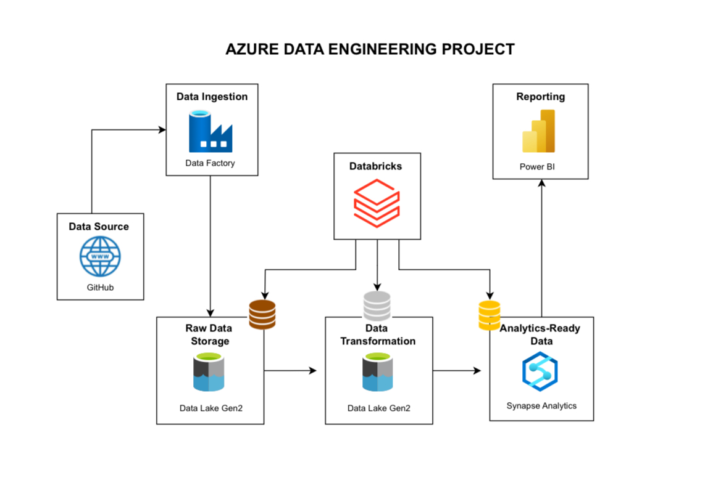

# AdventureWorks Azure Data Engineering Pipeline

🚀 **End-to-End Azure Data Engineering Project using AdventureWorks Dataset**

This hands-on project simulates a real-world enterprise data engineering workflow using Microsoft Azure. It demonstrates how raw CSV data from GitHub is ingested, processed, and transformed through a modern data lakehouse architecture — from ingestion to BI reporting.

---

## 📌 Project Architecture Overview

---

## 🔧 Tools & Services Used

- **Azure Data Factory** – ForEach + Lookup to dynamically ingest CSVs from GitHub
- **Azure Data Lake Storage Gen2** – Bronze and Silver layer storage
- **Azure Databricks** – PySpark-based data transformations
- **Azure Synapse Analytics** – Serverless SQL Pool for external tables/views
- **Power BI** – Data visualization by connecting to the Synapse gold layer
- **GitHub** – Source data + project repository

---

## 📁 Project Folder Structure

AdventureWorks-Azure-DataEngineering/
├── data_sample/              
# Sample input CSVs
├── notebooks/                
# Databricks notebook (.dbc format)
├── sql/                      
# SQL scripts (external tables, views)
├── azure_adf_pipelines/      
# ADF ARM template + pipeline JSON
├── assets/                   
# Architecture diagram image
└── README.md                 
# Project documentation

---

## 🔑 Key Highlights

- ✅ **Dynamic Ingestion** with ADF ForEach + Lookup
- ✅ **Bronze → Silver → Gold** lakehouse structure
- ✅ **PySpark Transformations** in Databricks
- ✅ **External Table Modeling** in Synapse Serverless SQL
- ✅ **Connected to Power BI** for reporting (PBIX not uploaded)

---

## 📁 Included Files

- `data_sample/*.csv`: Raw sample input files
- `notebooks/AdventureWorks_Transformations.dbc`: Databricks notebook archive
- `sql/create_external_tables.sql`: T-SQL for Synapse
- `azure_adf_pipelines/*.json`: Exported ADF templates + pipeline
- `assets/project_overview.jpg`: Project diagram

---

## 🧠 What You'll Learn

- How to design a multi-layered Azure data pipeline
- Orchestrate ingestion using ADF with GitHub as source
- Clean and transform data using Databricks + PySpark
- Create Synapse Serverless external tables for BI
- Build a scalable analytics pipeline for Power BI

---

## 🙏 Special Thanks

This project was inspired and guided by **Ansh Lamba**'s tutorials and walkthroughs on YouTube.  
🔗 [YouTube Channel – Learn Data Engineering](https://www.youtube.com/@AnshLambaJSR)

---

## 👨‍💻 Author

**Prakash Pyakurel**  
📧 [prakashpyakurel@outlook.com](mailto:prakashpyakurel@outlook.com)  
🔗 [LinkedIn](https://www.linkedin.com/in/prakashpyakurel/)  
🔗 [GitHub](https://github.com/prakash-pyakurel)

---

> ⭐ *Project built independently from scratch with help from community tutorials. Documented and structured to reflect industry-grade workflows.*

